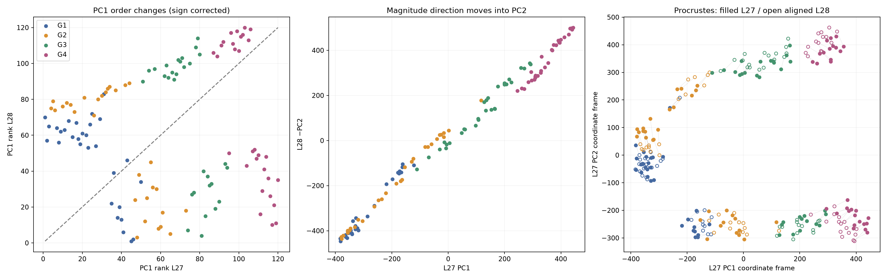

# Crystal L27–L28 hypothesis test

**Scope:** `llm360-crystal`, `run_00`, saved layer indices **27 and 28**, **k = 4**.
All geometry was recomputed from the existing hidden vectors. No model weights were loaded, no LLM was run, and no hidden states were regenerated.

## Main finding: PC1 changes which structure it measures

**OBSERVATION:** The PC1 magnitude correlation falls from **0.919552848 to 0.107823152**, but L28 PC2 retains **|Spearman rho| = 0.911013260**. L27 PC1 and L28 PC2 scores correlate at **Pearson r = −0.993273362**. The high-dimensional graph retains **320/336 = 95.238095%** of L27 edges, with edge-set **Jaccard = 0.911680912**. Thus the PC1-only metric changes dramatically while much of the geometry and local connectivity remains.

**INTERPRETATION:** The best supported explanation for the rho collapse is a near exchange of the two dominant PCA directions, accompanied by some real change in shape and scale. The branches align with decimal-boundary position, leading-digit categories, actual first completion-token IDs, and completion length, but these features are confounded in this sample. Their causal origin cannot be uniquely identified from these saved representations.



## 1. Data and reconstruction checks

NPZ keys: `hidden_states`, `targets`, `group_ids`, `point_ids`. Hidden states have shape **(33, 120, 4096)** and dtype **float32**. The other arrays have shape **(120,)** with original dtypes float64, int16, and int32, respectively. All **120/120** point IDs, targets, and groups match `prompts.json` exactly and in the same order; all selected hidden vectors are finite. Layer 0 is the embedding output, so no layer-index offset was introduced.

| group | n | min | max | unique_targets |
| --- | --- | --- | --- | --- |
| G1 | 30 | 1 | 39 | 21 |
| G2 | 30 | 82 | 119 | 22 |
| G3 | 30 | 982 | 1018 | 18 |
| G4 | 30 | 9983 | 10018 | 22 |

| point_id | target | group | prompt |
| --- | --- | --- | --- |
| 0 | 8 | G1 | 1040=1040,6304=6304,6252=6252,8= |
| 1 | 2 | G1 | 9763=9763,7668=7668,8669=8669,2= |
| 2 | 18 | G1 | 4119=4119,9064=9064,188=188,18= |
| 3 | 16 | G1 | 1876=1876,8797=8797,4371=4371,16= |
| 4 | 15 | G1 | 5573=5573,1827=1827,4808=4808,15= |

Repeated numerical values are separate observations with different prompts. Every output retains `point_id`; branch lists preserve multiplicities. Numerical ranks use average ranks for ties. There are **45 pairs of observations with equal targets**; neither layer has a PC1-coordinate tie.

The analyzed NPZ is `../results/main_final/main/llm360-crystal/run_00/hidden_states.npz`, SHA-256 `3cc2b9795e08fbb643682dde118aa19b7be1f18c35a59ad8895d029886d29bcb`; the `Downloads/main_final` copy has the same hash. Full provenance and package versions are recorded in [provenance.json](provenance.json).

PCA uses **unscaled, centered float32 vectors**, `PCA(n_components=2, svd_solver="full")`. The explicit full SVD avoids randomized-solver variability; reconstructed PC1 rhos match the archived metrics to numerical precision and PC1 explained-variance fractions agree within 2×10⁻⁶. Each PC1 is independently oriented to nonnegative target Spearman; its score and loading signs are changed together. PC2 uses the arbitrary SVD sign, so its negative rho at L28 is not a loss of magnitude information.

The original graph implementation in `numzig/plots.py::_knn_edges_highdim` calls `NearestNeighbors(n_neighbors=4, metric="euclidean").fit(X).kneighbors()` **with the query omitted**, which returns four non-self neighbors. This behavior is reproduced, giving **480 directed relations per layer**. Independently computed float64 Euclidean distances give the same four neighbors **in the same rank order for all 240 node/layer cases**. Undirected edges are the union of directed relations, not only mutual neighbors. The CSVs retain direction flags and neighbor ranks; PCA2 distances are explicitly visualization distances and never choose neighbors.

| layer | explained_variance_PC1 | explained_variance_PC2 | Spearman_target_PC1 | Spearman_target_PC2 | Pearson_target_PC1 | Pearson_target_PC2 |
| --- | --- | --- | --- | --- | --- | --- |
| 27 | 0.2254 | 0.189382 | 0.919553 | 0.107677 | 0.79443 | 0.151328 |
| 28 | 0.234855 | 0.210625 | 0.107823 | -0.911013 | 0.203691 | -0.750723 |

Explained variances above are **fractions**, not percentages: L27 PC1/PC2 explain **22.539994% / 18.938231%** and L28 explain **23.485497% / 21.062550%**, totaling **41.478226% / 44.548047%**. A large amount of variance lies outside the displayed plane, so displayed distances need not approximate full-space distances closely.

## 2. Exact branches and objective connectivity

KMeans was fitted **separately within each group** to its coordinates from the global layer PCA: `KMeans(n_clusters=2, random_state=0, n_init=50)`. Coordinates were not standardized and PCA was not refitted within groups. Cluster labels were then renamed so branch 0 has the lower mean target; this renaming does not affect the fit. This is a specified two-cluster summary of the visual split, not a claim that exactly two clusters is the natural answer.

The assignments below are **identical at L27 and L28**, with adjusted Rand index **1.000000 for each of G2, G3, G4**. Notation is **target [point_id]**, so repeated targets remain identifiable. Branch 0 is below the central power of ten; branch 1 is at or above it.

**G2, branch 0, n=17:** 82 [43], 82 [56], 84 [55], 85 [36], 85 [48], 85 [59], 86 [35], 86 [38], 87 [46], 89 [32], 92 [54], 93 [33], 94 [57], 96 [42], 97 [31], 98 [50], 98 [58].

**G2, branch 1, n=13:** 101 [30], 101 [34], 102 [39], 102 [40], 103 [52], 104 [37], 104 [47], 109 [44], 114 [45], 115 [49], 116 [53], 118 [41], 119 [51].

**G3, branch 0, n=17:** 982 [85], 983 [83], 984 [71], 984 [89], 986 [61], 990 [66], 990 [73], 990 [76], 993 [69], 994 [60], 994 [81], 994 [84], 995 [75], 997 [63], 997 [70], 997 [79], 997 [88].

**G3, branch 1, n=13:** 1000 [82], 1000 [86], 1002 [68], 1003 [65], 1003 [67], 1004 [62], 1004 [78], 1005 [87], 1009 [64], 1009 [77], 1014 [74], 1015 [80], 1018 [72].

**G4, branch 0, n=14:** 9983 [114], 9985 [113], 9987 [115], 9988 [99], 9988 [110], 9989 [97], 9989 [116], 9990 [117], 9993 [90], 9993 [93], 9994 [109], 9995 [100], 9996 [98], 9996 [103].

**G4, branch 1, n=16:** 10000 [92], 10003 [108], 10005 [95], 10005 [107], 10007 [105], 10007 [118], 10009 [96], 10011 [94], 10011 [112], 10012 [111], 10014 [102], 10015 [101], 10016 [91], 10017 [104], 10017 [106], 10018 [119].

Raw target/PC1/PC2 tables are in the two `nodes.csv` files and printed **before clustering** in [analysis_details.txt](analysis_details.txt). [crystal_branch_membership.csv](crystal_branch_membership.csv) contains all branch lists and separate ID lists for both layers. Every target has a label in the complete plots and an individually spaced label with a leader line in its group plot.

| Group | L27 plot | L28 plot |
| --- | --- | --- |
| Complete | [L27 all](crystal_L27_PCA_all_groups.png) | [L28 all](crystal_L28_PCA_all_groups.png) |
| G1 | [L27 G1](crystal_L27_PCA_G1.png) | [L28 G1](crystal_L28_PCA_G1.png) |
| G2 | [L27 G2](crystal_L27_PCA_G2.png) | [L28 G2](crystal_L28_PCA_G2.png) |
| G3 | [L27 G3](crystal_L27_PCA_G3.png) | [L28 G3](crystal_L28_PCA_G3.png) |
| G4 | [L27 G4](crystal_L27_PCA_G4.png) | [L28 G4](crystal_L28_PCA_G4.png) |

The within-group graph is the **induced portion of the global 4096-D kNN graph**; kNN is not refitted within a group. Components below are undirected/weak components. Strong-component counts are also saved in the connectivity CSV.

| layer | group | weak_components | within_group_edges | edges_between_kmeans_branches | silhouette_PCA2 | silhouette_4096d_same_labels |
| --- | --- | --- | --- | --- | --- | --- |
| 27 | G2 | 3 | 78 | 0 | 0.765948 | 0.255857 |
| 27 | G3 | 2 | 73 | 0 | 0.840855 | 0.375872 |
| 27 | G4 | 2 | 89 | 0 | 0.898858 | 0.437738 |
| 28 | G2 | 3 | 78 | 0 | 0.721757 | 0.268207 |
| 28 | G3 | 2 | 71 | 0 | 0.867846 | 0.431617 |
| 28 | G4 | 2 | 88 | 0 | 0.905212 | 0.500515 |

**OBSERVATION:** G3 and G4 each have exactly two induced graph components that coincide with their two KMeans branches. G2 has **three components at both layers**: 10 observations beginning with **8**, seven beginning with **9**, and 13 beginning with **1**. Its two-cluster visual summary merges the 8 and 9 components. There are **zero within-group edges between KMeans branches** in all six group/layer cases. Full component target/ID lists are in [crystal_within_group_connectivity.csv](crystal_within_group_connectivity.csv).

**INTERPRETATION:** The branch split has support beyond a 2D image, although the finer G2 structure is not fully represented by KMeans with k=2. Its 8-versus-9 separation is also consistent with leading-digit/token distinctions beyond the central power-of-ten split. It is still confounded with numerical position within G2, and disconnection at this single sparse k does not establish a causal categorical code.

## 3. Leading digit, boundary side, and tokenizer test

The original extraction diagnostics specify `LLM360/Crystal`, fast tokenizer enabled, class `CrystalCoderTokenizerFast`, no prepended BOS, and no pinned model/tokenizer revision. The repository now resolves to `IFM/Crystal`. The retrieved tokenizer assets are pinned to **34fc9cd58acd87002560379a95b432147cc9135a**. The configuration's AutoTokenizer mapping references the CrystalCoder wrapper; the retrieved mapped wrapper and the Crystal wrapper are byte-identical. Sources: [pinned tokenizer configuration](https://huggingface.co/IFM/Crystal/blob/34fc9cd58acd87002560379a95b432147cc9135a/tokenizer_config.json), [pinned wrapper](https://huggingface.co/IFM/Crystal/blob/34fc9cd58acd87002560379a95b432147cc9135a/tokenization_crystalcoder_fast.py), [tokenizer backend](https://huggingface.co/IFM/Crystal/blob/34fc9cd58acd87002560379a95b432147cc9135a/tokenizer.json).

Only the tokenizer backend was loaded. Inspection verifies that this wrapper adds no further text preprocessing, and uses neither BOS nor EOS by default; its identity postprocessor matches the saved backend. For every saved prompt, the complete `prompt + target_text` encoding begins with exactly the encoding of `prompt`. All **120 prefix checks pass**, the final prompt token is **29922 (`=`)** for all 120, and all **12 archived tokenizer diagnostic samples** match. No historical tokenizer file/hash was saved, so these checks support compatibility but cannot prove byte-for-byte identity with the tokenizer retrieved during the original run.

**Context matters here:** isolated target tokenization adds a leading metaspace token **29871 (`▁`)**. Thus **0/120 isolated sequences equal the true contextual continuation sequences**. Treating the isolated first token as the completion's first token would incorrectly assign the same leading whitespace token to every point. Contextual continuations instead consist of one token per decimal digit and decode exactly to each target.

| first_decimal_digit | first_completion_token_id | first_completion_token_text |
| --- | --- | --- |
| 1 | 29896 | 1 |
| 2 | 29906 | 2 |
| 3 | 29941 | 3 |
| 6 | 29953 | 6 |
| 7 | 29955 | 7 |
| 8 | 29947 | 8 |
| 9 | 29929 | 9 |

| point_id | target | full_completion_token_ids | number_of_completion_tokens |
| --- | --- | --- | --- |
| 30 | 101 | [29896, 29900, 29896] | 3 |
| 50 | 98 | [29929, 29947] | 2 |
| 82 | 1000 | [29896, 29900, 29900, 29900] | 4 |
| 92 | 10000 | [29896, 29900, 29900, 29900, 29900] | 5 |

These are the tokens of the **specified correct answer continuation**, not measurements of the model's most likely predicted token. Tokenizers do not predict; no logits, generation, output-head probe, or intervention was evaluated. The complete per-point sequences, decoded token texts, backend token pieces, isolated sequences, and prompt IDs are in [crystal_target_tokenization.csv](crystal_target_tokenization.csv).

### Descriptive association metrics

Let `C` be KMeans branch and `F` a feature. **Cluster purity** is Σ_C max_F count(C,F)/n, the standard cluster→feature measure. **Feature→cluster accuracy** is Σ_F max_C count(C,F)/n, obtained by assigning each feature category its majority branch. Accuracy is an **in-sample categorical association**, not a trained or cross-validated prediction result. AMI is adjusted mutual information (arithmetic normalization). Multi-category features can predict two branches perfectly while having purity/AMI below one, because they refine a branch into multiple labels. This matters for G2 digits 8/9 and for exact/above boundary labels in G3/G4.

The following metrics apply **at both L27 and L28**; all four requested features have **100% feature→cluster accuracy**. Majority-branch baselines are **17/30 = 56.666667%** for G2/G3 and **16/30 = 53.333333%** for G4.

| group | feature | cluster_purity | adjusted_mutual_information | feature_to_cluster_majority_accuracy |
| --- | --- | --- | --- | --- |
| G2 | leading_decimal_digit | 0.766667 | 0.771451 | 1 |
| G2 | boundary_side | 1 | 1 | 1 |
| G2 | first_completion_token_id | 0.766667 | 0.771451 | 1 |
| G2 | number_of_completion_tokens | 1 | 1 | 1 |
| G3 | leading_decimal_digit | 1 | 1 | 1 |
| G3 | boundary_side | 0.933333 | 0.873652 | 1 |
| G3 | first_completion_token_id | 1 | 1 | 1 |
| G3 | number_of_completion_tokens | 1 | 1 | 1 |
| G4 | leading_decimal_digit | 1 | 1 | 1 |
| G4 | boundary_side | 0.966667 | 0.912446 | 1 |
| G4 | first_completion_token_id | 1 | 1 | 1 |
| G4 | number_of_completion_tokens | 1 | 1 | 1 |

**Which variable most cleanly matches the split?** Completion-token **length has purity = AMI = accuracy = 1 in every group**. The binary boundary rule **below versus at-or-above** is identical to this partition and also matches perfectly; leading **1 versus non-1** does too. Raw leading-digit/first-token labels match G3/G4 exactly but subdivide G2's lower branch into 8 and 9. The requested three-valued boundary feature matches G2 exactly but subdivides the upper branch into exact and above in G3/G4. Consequently, the small AMI/purity differences reflect category granularity, not evidence for one mechanism over another.

Within each group, **leading digit 1 ⇔ first token 29896 ⇔ target at/above the center ⇔ one additional decimal/completion token** for all 90 G2–G4 observations. Thus neither perfect accuracy nor actual tokenizer IDs resolves the main confounding. Full token sequences are saved; because they reconstruct the target itself, treating every sequence as a separate classifier category would be an uninformative lookup rather than a test of a token mechanism.

### Exact contingency counts (identical at both layers)

Each cell below counts observations. Boundary centers are G2=100, G3=1000, G4=10000. No G2 point is exactly 100; two G3 points equal 1000 and one G4 point equals 10000.

**Cluster vs leading_decimal_digit:**

| group | cluster_id | 1 | 8 | 9 |
| --- | --- | --- | --- | --- |
| G2 | 0 | 0 | 10 | 7 |
| G2 | 1 | 13 | 0 | 0 |
| G3 | 0 | 0 | 0 | 17 |
| G3 | 1 | 13 | 0 | 0 |
| G4 | 0 | 0 | 0 | 14 |
| G4 | 1 | 16 | 0 | 0 |

**Cluster vs boundary_side:**

| group | cluster_id | above | below | exact |
| --- | --- | --- | --- | --- |
| G2 | 0 | 0 | 17 | 0 |
| G2 | 1 | 13 | 0 | 0 |
| G3 | 0 | 0 | 17 | 0 |
| G3 | 1 | 11 | 0 | 2 |
| G4 | 0 | 0 | 14 | 0 |
| G4 | 1 | 15 | 0 | 1 |

**Cluster vs first_completion_token_id:**

| group | cluster_id | 29896 | 29929 | 29947 |
| --- | --- | --- | --- | --- |
| G2 | 0 | 0 | 7 | 10 |
| G2 | 1 | 13 | 0 | 0 |
| G3 | 0 | 0 | 17 | 0 |
| G3 | 1 | 13 | 0 | 0 |
| G4 | 0 | 0 | 14 | 0 |
| G4 | 1 | 16 | 0 | 0 |

**Cluster vs number_of_completion_tokens:**

| group | cluster_id | 2 | 3 | 4 | 5 |
| --- | --- | --- | --- | --- | --- |
| G2 | 0 | 17 | 0 | 0 | 0 |
| G2 | 1 | 0 | 13 | 0 | 0 |
| G3 | 0 | 0 | 17 | 0 | 0 |
| G3 | 1 | 0 | 0 | 13 | 0 |
| G4 | 0 | 0 | 0 | 14 | 0 |
| G4 | 1 | 0 | 0 | 0 | 16 |

The supplied examples `99`, `999`, and `9999` are not in this run; they were not invented or added. Conclusions concern the actual sampled targets only.

## 4. Exact cross-group bridges and their distances

All edges below are deduplicated undirected **4096-D** nearest-neighbor relations. Endpoint notation is **target [point_id] (group)**. Distances are in the raw hidden-vector coordinate units; PCA2 is an orthogonal projection in those units, with discarded dimensions omitted.

Cross-group edge counts are **L27: G1–G2 12, G2–G3 2, G3–G4 6**; **L28: 12, 3, 7** respectively. Other group pairs have **zero** cross-group edges at both layers. Every cross-group edge, including G1–G2, is printed in [analysis_details.txt](analysis_details.txt) and the two `cross_group_edges.csv` files.

| Layer | A | B | Digits A/B | 4096-D distance | PCA2 distance | 4096-D / PCA2 |
| --- | --- | --- | --- | --- | --- | --- |
| 27 | 104 [47] (G2) | 1015 [80] (G3) | 1/1 | 754.379166 | 153.629715 | 4.910373 |
| 27 | 103 [52] (G2) | 1018 [72] (G3) | 1/1 | 646.117155 | 143.630491 | 4.498468 |
| 27 | 1003 [67] (G3) | 10003 [108] (G4) | 1/1 | 501.821263 | 92.227933 | 5.441098 |
| 27 | 1003 [67] (G3) | 10007 [118] (G4) | 1/1 | 483.418545 | 108.819105 | 4.442405 |
| 27 | 997 [79] (G3) | 9996 [98] (G4) | 9/9 | 511.581544 | 109.846811 | 4.657227 |
| 27 | 997 [79] (G3) | 9989 [116] (G4) | 9/9 | 513.080754 | 132.694479 | 3.866632 |
| 27 | 1000 [82] (G3) | 10000 [92] (G4) | 1/1 | 459.832424 | 110.431366 | 4.163966 |
| 27 | 997 [88] (G3) | 9995 [100] (G4) | 9/9 | 429.4631 | 167.82305 | 2.559023 |
| 28 | 93 [33] (G2) | 993 [69] (G3) | 9/9 | 502.701468 | 179.255529 | 2.804385 |
| 28 | 104 [47] (G2) | 1014 [74] (G3) | 1/1 | 830.700367 | 98.625932 | 8.422738 |
| 28 | 103 [52] (G2) | 1018 [72] (G3) | 1/1 | 705.347728 | 142.031168 | 4.966147 |
| 28 | 1003 [67] (G3) | 10007 [105] (G4) | 1/1 | 537.638352 | 73.545441 | 7.310288 |
| 28 | 1003 [67] (G3) | 10003 [108] (G4) | 1/1 | 533.37526 | 89.043948 | 5.990023 |
| 28 | 1003 [67] (G3) | 10007 [118] (G4) | 1/1 | 514.339951 | 103.835774 | 4.953398 |
| 28 | 997 [79] (G3) | 9996 [98] (G4) | 9/9 | 551.28425 | 90.556863 | 6.087714 |
| 28 | 997 [79] (G3) | 9989 [116] (G4) | 9/9 | 564.681152 | 128.543799 | 4.392909 |
| 28 | 1000 [82] (G3) | 10000 [92] (G4) | 1/1 | 497.389617 | 116.789154 | 4.258868 |
| 28 | 997 [88] (G3) | 9995 [100] (G4) | 9/9 | 459.392976 | 160.279548 | 2.866198 |

**OBSERVATION:** Every G2–G3 and G3–G4 bridge joins the same leading digit and therefore the same first contextual token. L28 adds **93 [33]–993 [69]**, replaces **104 [47]–1015 [80]** with **104 [47]–1014 [74]**, and adds a second instance of **1003 [67]–10007 [105]** alongside the retained edge to **10007 [118]**. All six L27 G3–G4 bridges survive. Across all group boundaries, same-first-token edges are **18/20** at L27 and **21/22** at L28; G1–G2 provides the exceptions.

**Distance distortion:** G2–G3 true distances are **4.498468–4.910373×** the PCA2 distances at L27 and **2.804385–8.422738×** at L28. For G3–G4 they are **2.559023–5.441098×** and **2.866198–7.310288×**. Across all cross-group edges the maximum factor is **33.285075×** at L27 and **20.766281×** at L28. For example, **9 [5]–97 [31]** appears only **14.558024** units apart in L27 PCA2 but is **484.564898** units apart in 4096-D. Visual proximity is not a reliable absolute-distance estimate.

A communicator's degree counts **distinct undirected cross-group incident edges**, not directed nominations. The complete rankings, leading digits, and exact connected nodes are in [L27 communicators](crystal_L27_communicators.csv) and [L28 communicators](crystal_L28_communicators.csv). Highest-degree communicators are:

| Layer | Communicator | Digit | Cross-group degree | Exact connected nodes |
| --- | --- | --- | --- | --- |
| 27 | 8 [0] (G1) | 8 | 4 | 89 [32] (G2); 86 [35] (G2); 86 [38] (G2); 85 [48] (G2) |
| 27 | 9 [5] (G1) | 9 | 4 | 97 [31] (G2); 93 [33] (G2); 98 [50] (G2); 98 [58] (G2) |
| 27 | 97 [31] (G2) | 9 | 3 | 9 [5] (G1); 7 [6] (G1); 6 [13] (G1) |
| 27 | 1003 [67] (G3) | 1 | 2 | 10003 [108] (G4); 10007 [118] (G4) |
| 27 | 997 [79] (G3) | 9 | 2 | 9996 [98] (G4); 9989 [116] (G4) |
| 28 | 8 [0] (G1) | 8 | 4 | 89 [32] (G2); 86 [35] (G2); 86 [38] (G2); 85 [48] (G2) |
| 28 | 9 [5] (G1) | 9 | 4 | 97 [31] (G2); 93 [33] (G2); 98 [50] (G2); 98 [58] (G2) |
| 28 | 1003 [67] (G3) | 1 | 3 | 10007 [105] (G4); 10003 [108] (G4); 10007 [118] (G4) |
| 28 | 97 [31] (G2) | 9 | 2 | 9 [5] (G1); 7 [6] (G1) |
| 28 | 93 [33] (G2) | 9 | 2 | 9 [5] (G1); 993 [69] (G3) |
| 28 | 115 [49] (G2) | 1 | 2 | 14 [14] (G1); 15 [15] (G1) |
| 28 | 997 [79] (G3) | 9 | 2 | 9996 [98] (G4); 9989 [116] (G4) |

There are **30 communicator observations at L27** and **32 at L28**. The all-edge exports preserve enough information to recover all directions, reciprocal nominations, and nearest-neighbor ranks for every bridge.

## 5. What changes the PC1 ranks?

All ranks here use independently sign-oriented PC1. The drop is **0.811729696**. The two largest absolute movements belong to separate prompts targeting **10011**: point **94** moves **119→11 (−108)** and point **112** moves **117→10 (−107)**. Several large, leading-1 targets move far down PC1 while lower leading-8/9 targets move up. These are changes in ordering along a different dominant axis, not necessarily large movements relative to neighboring points in 4096-D.

The 15 largest absolute movements are shown below. The requested **top 30** are printed in the full log and saved in [crystal_L27_L28_top30_rank_changes.csv](crystal_L27_L28_top30_rank_changes.csv). All 120 observations, both PC1 coordinates, both ranks, and signed changes are in [crystal_L27_L28_pc1_rank_changes.csv](crystal_L27_L28_pc1_rank_changes.csv).

| point_id | target | group | PC1_rank_L27 | PC1_rank_L28 | rank_change |
| --- | --- | --- | --- | --- | --- |
| 94 | 10011 | G4 | 119 | 11 | -108 |
| 112 | 10011 | G4 | 117 | 10 | -107 |
| 119 | 10018 | G4 | 118 | 21 | -97 |
| 107 | 10005 | G4 | 111 | 16 | -95 |
| 102 | 10014 | G4 | 116 | 26 | -90 |
| 91 | 10016 | G4 | 120 | 35 | -85 |
| 118 | 10007 | G4 | 112 | 29 | -83 |
| 106 | 10017 | G4 | 115 | 36 | -79 |
| 78 | 1004 | G3 | 81 | 4 | -77 |
| 32 | 89 | G2 | 5 | 79 | 74 |
| 101 | 10015 | G4 | 113 | 41 | -72 |
| 35 | 86 | G2 | 4 | 75 | 71 |
| 0 | 8 | G1 | 1 | 70 | 69 |
| 65 | 1003 | G3 | 88 | 19 | -69 |
| 55 | 84 | G2 | 6 | 74 | 68 |

For an exact attribution of the rho drop with tied numerical targets, the analysis decomposes Spearman's rank covariance. Each point contributes `(numerical_rank − mean_rank) × (PC1_rank_L27 − PC1_rank_L28) / D`, where `D` is the product of the centered-rank norms. PC1 ranks are untied at both layers, so `D` is the same. These signed contributions sum exactly to **0.811729696**; they are arithmetic contributions, not causal effects.

| group | contribution_to_rho_drop |
| --- | --- |
| G1 | 0.209878 |
| G2 | 0.121846 |
| G3 | 0.089407 |
| G4 | 0.390598 |

The largest individual positive contribution is **10018 [119]: 0.040086403**, followed by **10011 [94]: 0.039006366** and **10011 [112]: 0.038645196**. Ranking absolute movement alone and ranking contribution to the loss of magnitude correlation are different questions.

### Pairwise inversions

Of **7,140 observation pairs**, **3,439 (48.165266%)** reverse their PC1 ordering: **1,201 within groups** and **2,238 between groups**. Of the 45 equal-target pairs, **16** reverse; these are changes between different prompt observations of the same number, not numerical-order inversions. Excluding equal-target pairs leaves **3,423 / 7,095 = 48.245243%** flips. No PC1 ties need to be excluded.

| group_pair | total_pairs | flips | flip_percent | equal_target_flips | concordant_to_discordant | discordant_to_concordant |
| --- | --- | --- | --- | --- | --- | --- |
| G1-G1 | 435 | 321 | 73.793103 | 6 | 103 | 212 |
| G1-G2 | 900 | 580 | 64.444444 | 0 | 321 | 259 |
| G1-G3 | 900 | 305 | 33.888889 | 0 | 305 | 0 |
| G1-G4 | 900 | 355 | 39.444444 | 0 | 355 | 0 |
| G2-G2 | 435 | 289 | 66.436782 | 3 | 227 | 59 |
| G2-G3 | 900 | 318 | 35.333333 | 0 | 281 | 37 |
| G2-G4 | 900 | 318 | 35.333333 | 0 | 318 | 0 |
| G3-G3 | 435 | 264 | 60.689655 | 2 | 236 | 26 |
| G3-G4 | 900 | 362 | 40.222222 | 0 | 351 | 11 |
| G4-G4 | 435 | 327 | 75.172414 | 5 | 287 | 35 |

`concordant_to_discordant` counts pairs ordered with magnitude at L27 but against it at L28; the reverse column counts improvements. Equal-target pairs contribute to neither column. Pair counts are descriptive; they are not independent trials and are not p-values.

Representative largest reorganizations, ranked by the change in signed rank separation:

| point_id_A | target_A | point_id_B | target_B | rank_A_L27 | rank_B_L27 | rank_A_L28 | rank_B_L28 | rank_gap_reorganization |
| --- | --- | --- | --- | --- | --- | --- | --- | --- |
| 32 | 89 | 94 | 10011 | 5 | 119 | 79 | 11 | 182 |
| 32 | 89 | 112 | 10011 | 5 | 117 | 79 | 10 | 181 |
| 35 | 86 | 94 | 10011 | 4 | 119 | 75 | 11 | 179 |
| 35 | 86 | 112 | 10011 | 4 | 117 | 75 | 10 | 178 |
| 0 | 8 | 94 | 10011 | 1 | 119 | 70 | 11 | 177 |
| 0 | 8 | 112 | 10011 | 1 | 117 | 70 | 10 | 176 |

For example, **89 [32] versus 10011 [94]** changes from ranks **5<119** to **79>11**, a signed rank-gap change of **182**. The complete enumeration contains exactly the 3,439 flipped observation pairs in [crystal_L27_L28_pairwise_rank_flips.csv](crystal_L27_L28_pairwise_rank_flips.csv).

## 6. Graph preservation

| Quantity | Value |
| --- | --- |
| Undirected edges L27 | 336 |
| Undirected edges L28 | 335 |
| Intersection | 320 |
| Union | 351 |
| Edge-set Jaccard | 0.911680912 |
| Fraction of L27 edges retained | 0.952380952 |
| Lost / gained edges | 16 / 15 |
| Mean / median / minimum undirected node Jaccard | 0.910661376 / 1 / 0.5 |
| Mean / median / minimum directed-outgoing node Jaccard | 0.926666667 / 1 / 0.6 |
| Unchanged undirected neighborhoods | 75/120 |
| Unchanged outgoing four-neighbor sets | 98/120 |

Node Jaccard is `|N27 ∩ N28| / |N27 ∪ N28|`. Both definitions of neighborhood are explicitly saved; the undirected version includes incoming nominations and can have degree greater than four. The largest changes in undirected neighborhoods are:

| point_id | target | group | undirected_degree_L27 | undirected_degree_L28 | undirected_jaccard | undirected_lost_point_ids | undirected_gained_point_ids |
| --- | --- | --- | --- | --- | --- | --- | --- |
| 8 | 6 | G1 | 5 | 4 | 0.5 | [1, 6] | [3] |
| 2 | 18 | G1 | 4 | 4 | 0.6 | [3] | [4] |
| 6 | 7 | G1 | 4 | 4 | 0.6 | [8] | [11] |
| 13 | 6 | G1 | 4 | 4 | 0.6 | [31] | [3] |
| 17 | 39 | G1 | 4 | 4 | 0.6 | [25] | [19] |
| 24 | 29 | G1 | 4 | 4 | 0.6 | [1] | [18] |
| 47 | 104 | G2 | 4 | 4 | 0.6 | [80] | [74] |
| 49 | 115 | G2 | 4 | 4 | 0.6 | [37] | [14] |
| 67 | 1003 | G3 | 4 | 4 | 0.6 | [82] | [105] |
| 85 | 982 | G3 | 4 | 4 | 0.6 | [71] | [66] |
| 99 | 9988 | G4 | 4 | 4 | 0.6 | [93] | [90] |
| 101 | 10015 | G4 | 4 | 4 | 0.6 | [104] | [102] |

Point **8**, targeting **6**, is the only node with undirected Jaccard **0.5**: it loses points **1 (target 2)** and **6 (target 7)**, and gains point **3 (target 16)**. All pointwise values and all 31 edge additions/removals are saved. This strongly supports persistence of this run's local kNN structure; it does not establish that every aspect of numerical information is preserved.

## 7. PCA direction exchange and geometric similarity

Loading directions are compared in the shared 4096-coordinate residual space of the same model. Such comparisons are meaningful as coordinate comparisons here, but are not a proof of identical functional roles. Unsigned angles remove arbitrary PCA sign effects.

| Direction pair | Signed cosine | Unsigned angle |
| --- | --- | --- |
| L27 PC1 ↔ L28 PC1 | 0.068019982 | 86.099731° |
| L27 PC1 ↔ L28 PC2 | −0.947175449 | 18.706223° |
| L27 PC2 ↔ L28 PC1 | 0.907583269 | 24.826515° |
| L27 PC2 ↔ L28 PC2 | 0.082116880 | 85.289746° |

**The correspondence is predominantly cross-axis.** L27 PC1↔L28 PC2 score correlations are **Pearson −0.993273362 / Spearman −0.993110633**; L27 PC2↔L28 PC1 are **Pearson 0.991075104 / Spearman 0.995666366**. Same-axis PC1 correlations are only **Pearson 0.087814405 / Spearman −0.020973679**. The 2D loading subspaces have principal angles **17.931387° and 24.577536°**, so this is not an exact unchanged plane or a pure rigid rotation in full hidden space.

Across all 7,140 pairs, L27/L28 PCA2 distances correlate at **Pearson 0.986228540 / Spearman 0.984547960**. The corresponding original 4096-D distances correlate at **Pearson 0.985034132 / Spearman 0.977474690**. These correlations measure similarity, not equal absolute scales, and pairwise entries are dependent.

Procrustes alignment allows translation, orthogonal transformation, and one uniform scale; reflections are allowed by the algorithm but the fitted transform has determinant **+1**. Mapping L28 into L27's score frame gives scale **0.846182204** and normalized disparity **0.012520640**, with **1 − disparity = 0.987479360**. This is a normalized squared-fit statistic, not a graph-retention percentage. The fitted row-vector orthogonal matrix is `[[0.089691829, 0.995969566], [−0.995969566, 0.089691829]]`, approximately an **84.854°** coordinate rotation under this sign convention.

After alignment, the first L28 coordinate has magnitude Spearman **0.925831650**, and the aligned first-coordinate values correlate with L27 PC1 at **Pearson 0.997125692**. Independently, projecting L28 hidden vectors directly onto the old L27 PC1 loading yields magnitude Spearman **0.920875980**. This latter check does not fit an axis to L28 targets. Together these checks support numerical ordering remaining available outside L28 PC1.

## 8. Observation versus interpretation

| Candidate explanation | Assessment from this run |
| --- | --- |
| A. Magnitude / power-of-ten boundary | Strong descriptive match for below versus at-or-above in every group; it is confounded with decimal length and leading 1. Continuous magnitude ordering remains strong on L28 PC2. |
| B. First decimal character | Exact two-category match in G3/G4; G2's two branches separate 1 from {8,9}, while its induced graph additionally separates 8 and 9. |
| C. Actual first completion token | Same association as the first digit because contextual tokens are single decimal digits here. Compatible with token preparation; does not distinguish it from digit/boundary structure. |
| D. Tokenization length / sequence | Length matches all two-branch partitions exactly. It is identical to decimal length and boundary position within each group. Full sequences encode the target itself, so sequence identity is not an independent explanation. |
| E. Geometric restructuring | A near exchange of the first two PCA directions explains the PC1 rho collapse, with high graph and distance preservation. Some shape and full-space direction changes remain. |

**Conservative conclusion:** There is strong evidence for **geometric reorientation plus persistent decimal/boundary-associated structure**. The verified tokenizer makes first-token preparation a viable interpretation, but there is **insufficient evidence to prefer it causally** over boundary, input-digit, or length encoding. The target number is already written in the prompt immediately before `=`, so a representation of the preceding input digits could produce the same associations without demonstrating preparation of an output token. Random context examples, repeated targets, one run, two layers, forced k=2 clustering, and a single kNN k limit generalization. No claim of a tokenization artifact, onset at L28, or destruction of numerical structure is justified by these results.

Discriminating the mechanisms would require evidence that separates the confounded properties, such as matched numerical/digit/length conditions or an output-head/intervention test. Those experiments were not performed, in accordance with the request to analyze saved data only.

## Files and reproduction

- [analysis_details.txt](analysis_details.txt): full printed verification, raw coordinates, every cross-group edge, all communicators, exact branches and contingency tables, all ranks, top 30 changes, and metrics.
- `crystal_L27_nodes.csv`, `crystal_L28_nodes.csv`: requested per-point PCA/rank/prompt metadata.
- `crystal_L{27,28}_knn_directed.csv` and `_knn_undirected.csv`: graph relations and both distances.
- `crystal_L{27,28}_cross_group_edges.csv` and `_communicators.csv`: exact bridges and communicator rankings.
- `crystal_L{27,28}_branch_assignments.csv`, `crystal_branch_membership.csv`, `crystal_branch_feature_metrics.csv`, `crystal_branch_contingency_tables.csv`, `crystal_within_group_connectivity.csv`: objective branch checks.
- `crystal_target_tokenization.csv`: contextual and isolated tokenization checks for all 120 points.
- `crystal_L27_L28_pc1_rank_changes.csv`, `_top30_rank_changes.csv`, `_pairwise_rank_flips.csv`, `_rank_flip_summary.csv`: exact rank accounting.
- `crystal_L27_L28_neighbor_retention.csv`, `_changed_edges.csv`, `_procrustes_coordinates.csv`, `crystal_pca_metrics.csv`, `crystal_cross_group_distance_summary.csv`, `analysis_metrics.json`: graph, distances, and alignment.
- **11 PNG figures and 11 SVG counterparts**, including complete plots and four labeled group plots per layer, plus the alignment comparison. Use group plots to resolve overlapping labels in the complete views.
- `tokenizer/`: pinned tokenizer-only assets and metadata; `provenance.json`: source hashes, methods, versions, and limitations.

The scripts operate only on the saved arrays and tokenizer files. From the project root, reproduce with:

```sh
OPENBLAS_NUM_THREADS=1 OMP_NUM_THREADS=1 MPLCONFIGDIR=/private/tmp/crystal-mpl .venv/bin/python crystal_L27_L28_hypothesis_test/analyze.py
.venv/bin/python crystal_L27_L28_hypothesis_test/make_summary.py
```

## Scientific conclusion for discussion

In Crystal run_00, the sign-corrected target–PC1 Spearman correlation drops from **0.919553 at L27 to 0.107823 at L28**, while L28 PC2 retains **|rho| = 0.911013**. L27 PC1 and L28 PC2 scores correlate at **|Pearson r| = 0.993273**, and Procrustes disparity is **0.012521**, supporting a near exchange of dominant PCA directions with modest shape changes. The true 4096-D kNN graph retains **320/336 edges (95.24%)**, so the PC1 collapse does not indicate comparable destruction of local structure. The G2–G4 two-branch assignments are identical across layers and perfectly match below versus at-or-above the central power of ten, although G2's induced graph has three components separating leading 8, 9, and 1. Contextual tokenization confirms first completion IDs **29896 for 1, 29929 for 9, and 29947 for 8**; isolated tokenization would instead introduce a misleading leading metaspace token. Leading-digit/token categories, decimal-boundary position, and completion length all predict the two-branch assignments with **100% in-sample accuracy**, so this dataset cannot identify their causal priority. Nevertheless, **3,439/7,140 point pairs (48.17%)** reverse PC1 order, with the two observations targeting **10011** moving **119→11** and **117→10**. The evidence therefore supports geometric reorientation with persistent decimal-associated structure, while first-token preparation remains compatible with the observations but unproven.
